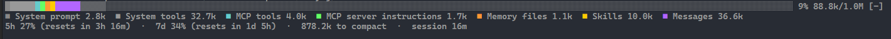

# akash-mods

A couple of mods I made for [Claude Code](https://claude.com/claude-code). I'm a uni student and I use Claude Code a lot
for assignments and side projects, and two things kept annoying me: I never knew how full the context window was
until it auto-compacted, and when it did compact I'd lose track of where I was. So I built these to fix that for
myself. They're small, but they've made my sessions a lot less messy, so I figured I'd share them.

| Mod | What it does | Status |
| --- | --- | --- |
| [context-bar](plugins/context-bar) | Always-on bar showing how full the context window is, plus your rate limits | Published in Claude's plugin directory |
| [context-handoff](plugins/context-handoff) | Hands a long session off cleanly before it compacts | In review for the directory |
| [session-pins](plugins/session-pins) | Pins notes to a session so they stay on screen and Claude keeps to them | New, not submitted yet |

## Install

```
/plugin marketplace add Akash001uts/claude-mods
/plugin install context-bar@akash-mods
/plugin install context-handoff@akash-mods
/plugin install session-pins@akash-mods
```

You can install just the ones you want. You need a recent Claude Code build that supports mods
(function-hook plugins). I built these on 2.1.288.

To get new versions, run `/plugin marketplace update akash-mods`.

## context-bar

A bar above (or below) the prompt that shows how full your context window is, split into the same categories `/context` uses
(system prompt, tools, memory files, messages and so on).



**Why it's useful:** I used to run `/context` every so often just to check. Now it's always there, so I can see when a
session is getting heavy and decide to wrap up before things get compacted. The third line shows your 5-hour and 7-day
rate limits, which is handy if you're on a subscription and don't want to hit the limit halfway through an assignment.
It's also good for finding what's eating your context, like MCP servers you forgot were still connected.

How it works:

- It turns on at the start of every session and updates after each turn.
- The first time it runs it prints a quick rundown of the commands in the chat, and `/context-bar help` shows it again.
- The third line shows your rate limits (subscription accounts only), how many tokens are left before auto-compact
  kicks in, and how long the session has been running. It hides itself if there isn't room for it.
- `/context-bar` hides or shows the bar for the current session.
- `/context-bar below` moves the bar under the prompt box if you'd rather have it there, and `/context-bar above` moves
  it back. It remembers your choice (it's also under "Bar position" in `/config`).
- `/context-bar details` opens a pane with the full breakdown: each category and its share of the window, every memory
  file, MCP servers (and how many of their tools are loaded), your biggest skills, custom agents, and the cache split
  of the last API call. Counting all that costs a few extra requests (same as `/context`), so it only refreshes while
  the pane is open, after each turn or when you press `r`.

## context-handoff

Once a session gets long, Claude tends to get worse at keeping track of things, and auto-compact doesn't always keep
the parts you actually need. This mod hands the work off properly instead. When the context window hits a threshold
(50% by default):

1. Claude gets asked to wrap up. It updates the docs your project already has, writes a handoff file
   (`.claude/handoff.md`), and drafts compaction instructions plus a kickoff prompt.
2. The mod runs `/compact` with those instructions, so the summary keeps what matters.
3. Once compaction finishes, it sends the kickoff prompt and Claude picks up from the handoff file.

**Why it's useful:** it's for longer pieces of work that don't fit in one context window, like a full assignment, a
project that's spread over a few days, or a big refactor. Without it you end up writing "here's where we're up to" notes by
hand before every compact. This does that for you, and the project docs stay up to date as a side effect. The
handoff file also means I can close the terminal, come back the next day and carry on without explaining everything
again.

It also lets Claude see how full the context is. Each prompt gets a hidden line like
`Context window: 34% used (68.0k of 200.0k)`, and Claude's told to suggest wrapping up (once, and only when a task is
actually finished) if the window is filling up. If you run `/context-handoff:wrap-up` yourself at the end of a session,
the kickoff prompt will be waiting in the prompt box next time you open a session in that project.

Commands and settings:

- It's on from the start of every session, like the bar. The status line shows `Handoff at 50%` so you know it's armed,
  and it changes to show what step it's on while a handoff is running.
- `/handoff` starts a handoff straight away, whatever the context level.
- `/handoff 60` (or `/handoff at 60%`) changes when the automatic handoff starts. Anything from 5% to 95% works, and it
  saves to the plugin's settings so it sticks between sessions.
- `/handoff off` and `/handoff on` pause or resume the automatic handoff for the current session.
- `/handoff status` shows the current reading and settings, and `/handoff resume` puts a saved kickoff prompt back in
  the box.
- In `/config` you can also change `mode`: `auto` (the default) does everything itself, `ask` puts the handoff prompt in
  the box for you to send, and `off` just shows Claude the reading. `handoffPath` changes where the handoff file goes.
- It only hands off from the main conversation, and only after a turn finishes normally. If you interrupt a turn it
  cancels, and Claude Code's own auto-compact never triggers the kickoff prompt.

## session-pins

Pins a note to the session. `/pin Use Australian spelling` puts it above the prompt with a 📌, and Claude gets it in
its system prompt as a standing instruction for the rest of the session.

**Why it's useful:** there's usually one or two things I want Claude to keep in mind the whole time ("don't touch the
tests folder", which branch I'm on, how I want things worded). Said once in chat, they scroll away and can get lost
when the session compacts. Pinned, they stay on screen for me and in the system prompt for Claude, so they survive a
compact.

- `/pin <text>` pins a note, and `/pin` on its own pins the last message you typed.
- `/pin list` shows them all, `/unpin 2` removes one, `/unpin` removes the latest and `/unpin all` clears them.
- `/pin hide` and `/pin show` hide or show them above the prompt (Claude still sees them).
- Pins come back if you resume the session, but `/clear` or a new session starts fresh.

## What they run and store

None of them send anything outside Claude Code. context-bar only reads the same usage numbers `/context` shows,
context-handoff adds one hidden line to each prompt and runs `/compact` during a handoff, and session-pins adds your pins to
the system prompt and saves them in plugin storage. Each plugin's own README has
the full list: [context-bar](plugins/context-bar/README.md#what-it-runs-and-stores),
[context-handoff](plugins/context-handoff/README.md#what-it-runs-and-stores),
[session-pins](plugins/session-pins/README.md#what-it-runs-and-stores).

## Notes

These are still pretty new, so there are probably rough edges. If something breaks or you've got an idea, feel free to
[open an issue](https://github.com/Akash001uts/claude-mods/issues).

This is a personal project and isn't affiliated with or endorsed by Anthropic.

## Licence

MIT
